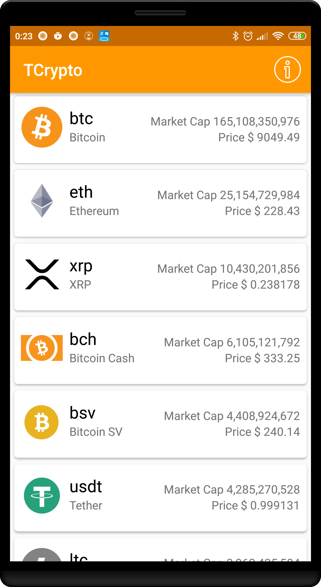
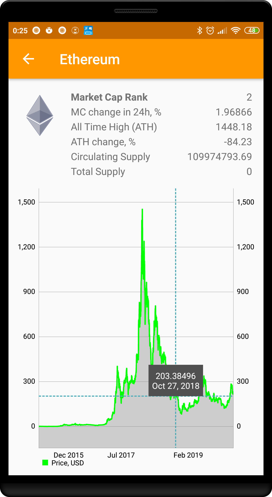
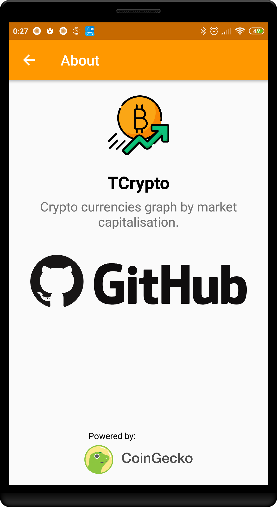
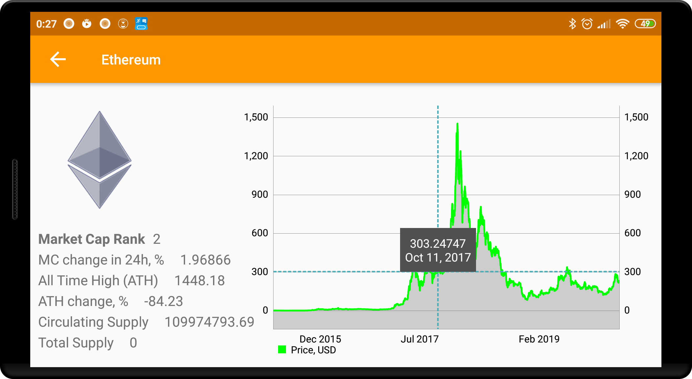

# TCrypto
A cryptocurrencies Android app written in Kotlin.

## Features
- list of top cryptocurrencies by market capitalization
- cryptocurrency detail stats
- cryptocurrency market cap interactive graph

## Tech Stack
- Kotlin
- RxJava
- MVP architecture
- Dependency Injection with Dagger 2
- Data from CoinGecko API with Gson and Retrofit
- Glide for images
- MPAndroidChart for charts

## Screenshots
  

## Acknowledgement
- Powered by <a href="https://www.coingecko.com/en/api" title="CoinGecko">CoinGecko API</a>
- App icon made by <a href="https://www.flaticon.com/authors/freepik" title="Freepik">Freepik</a> from <a href="https://www.flaticon.com/" title="Flaticon">www.flaticon.com</a>
